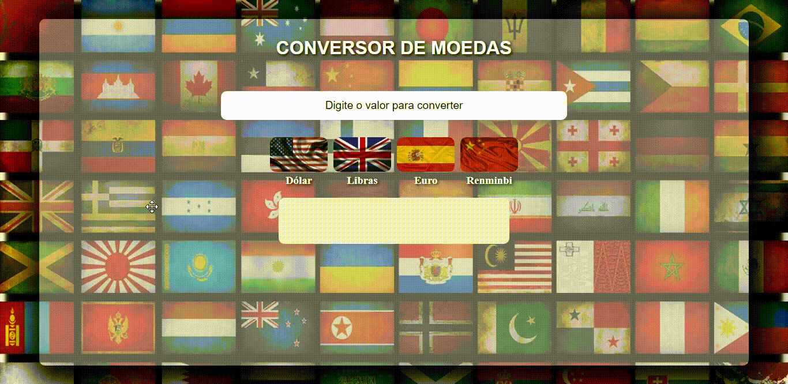

<h1 align="center">
    
</h1>

###  Sobre

**Conversor de moedas:** Ele pode converter dólar, libra, euro e Renminbi em real. Ele também mostra o valor da moeda a baixo

---
GitHub Pages: 
 
---
### 💻 Tecnologia utilizada

- HTML 5
- CSS 3
- JAVASCRIPT

---

